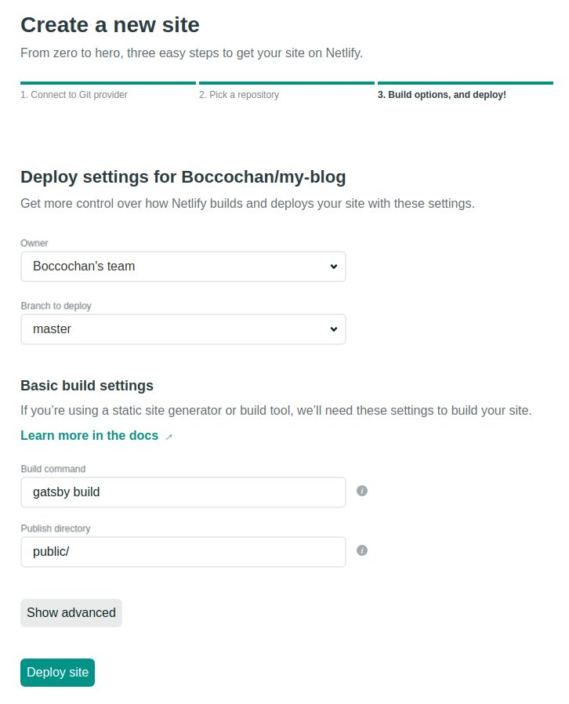

Let's create your blog site by using Gatsby + Typescript on Netlify.

## Setup

### Installing Gatsby

First of all, you need to install gatsby cli.

```
npm install -g gatsby-cli
```

### Getting a starter kit

```
gatsby new your-project-name https://github.com/gperl27/Gatsby-Starter-Blog-Typescript
cd your-project-name
gatsby develop
```

If you encounter some errors, you should remove node_modules and yarn.lock. Then, please install packages and upgrade them.

```
rm -rf node_modules
rm -rf yarn.lock
yarn install
yarn upgrade --latest
gatsby develop
```

## Creating a Github repostiory and push your project

You can use Gitlab or Bitbucket, but I'm using Github in here.
Please create a repository first.

In the directory,

```
git init
git add .
git commit -m "Initial commit"
```

Then,

```
git remote add origin https://github.com/yourname/your-blog-name.git
git push -u origin master
```

## Creating your Netlify account and deploy

You can create your Netlify account [here](https://app.netlify.com/). Then, click "New site from Git button".


I am going to deploy from Github, so I should select Github. But if you are using Gitlab and Bitbucket, you should select them.


Select your repository which you have created.


Click deploy site.



Now, you can see your blog site.


## Using your own URL

If you want to use your cool URL, you can use it.
I am going to explain how to do it by the other blog post. Coming soon!

## Creating a new blog

You can see a couple of sample blogs under content/blog. You can add a new blog there. But be careful, you should not delete those sample blogs yet. Probably, it will cause some errors.

I'm going to figure it out.
