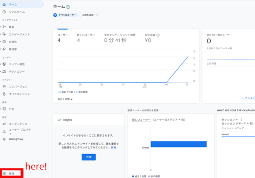
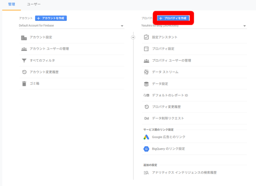
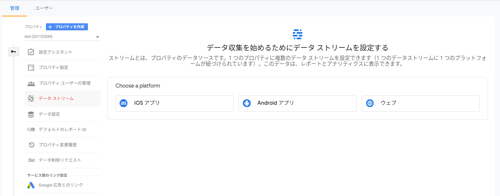
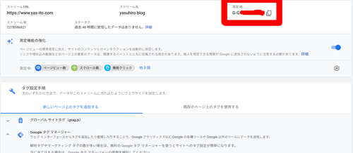
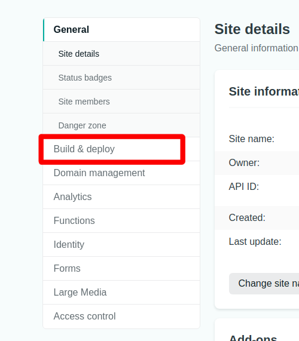
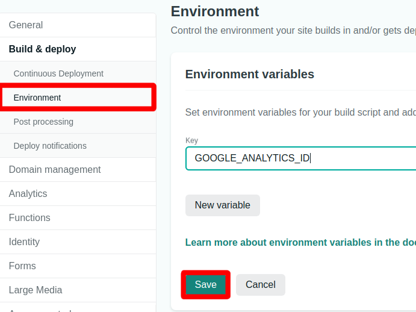

## 【最新】GatsbyでGoogle Analyticsを設定する

<div class="mt-8 mb-8">

- Google Analyticsの設定
- gatsby-plugin-google-gtagの設定
- Netlifyの設定
- 動作確認

</div>

ネットで調査した方法だとなかなか上手く行かなかったので、Gatsby + Netlifyの組み合わせでのGoogle Analyticsの設定方法を紹介します。
この記事は、すでにアカウントがある方を想定しています。


## Google Analyticsの設定

<p class="mt-8 mb-8">
ログイン後、画面左下の<strong>管理</strong>をクリックします。
</p>



<p class="mt-8 mb-8">
以下の画面が表示されたら、<strong>プロパティの作成</strong>をクリックして下さい。
</p>



<p class="mt-8 mb-8">
プロパティ、タイムゾーン、通過はお好みで設定して下さい。<br/>
すべて入力したら<strong>次へ</strong>をクリックします。
</p>


<p class="mt-8 mb-8">
規模、目的はお好みで設定して下さい。<br/>
すべて入力したら<strong>作成</strong>をクリックします。
</p>


<p class="mt-8 mb-8">
データストリームは<strong>ウェブ</strong>をクリックします。<br/>
</p>



<p class="mt-8 mb-8">
URL、名前を入力して、<strong>ストリームを作成</strong>をクリックします。
</p>


<p class="mt-8 mb-8">
以下の表示に切り替わるので、クリックして下さい。
</p>


<p class="mt-8 mb-8">
下記のGから始まる<strong>測定ID</strong>を後ほど使用します。
</p>



## gatsby-plugin-google-gtagの設定


<p class="mt-8 mb-8">
gatsby-plugin-google-gtagのインストール
</p>

```bash
yarn add -D gatsby-plugin-google-gtag
```

<p class="mt-8 mb-8">
もしくは
</p>


```bash
npm install --save-dev gatsby-plugin-google-gtag
```

<p class="mt-8 mb-8">
gatsby-config.jsonの設定をします。GOOGLE_ANALYTICS_IDは環境変数です。<br/>
Netlifyで設定することが可能です。
</p>


```json:gatsby-config.json
{
  plugins: [
    {
      resolve: `gatsby-plugin-google-gtag`,
      options: {
        trackingIds: [
          process.env.GOOGLE_ANALYTICS_ID,
        ],
      },
    },
  ]
}
```

## Netlifyの設定

<p class="mt-8 mb-8">
<strong>Site settings</strong>より、Build & deployを選択します。
</p>




<p class="mt-8 mb-8">
<strong>Site settings</strong>より、Build & deployを選択します。<br/>
あとは、environmentよりGOOGLE_ANALYTICS_IDを設定します。値にいれるのは、先程Google Analyticsで作成した<strong>測定ID</strong>です。<br/>
設定が完了したらsaveをクリックします。
</p>



## 動作確認

<p class="mt-8 mb-8">
まずは、自分のGatsbyをNetlifyへデプロイして下さい。
ただしく設定されていれば1日も経てばGoogle Analyticsに何やら表示されます。
</p>

