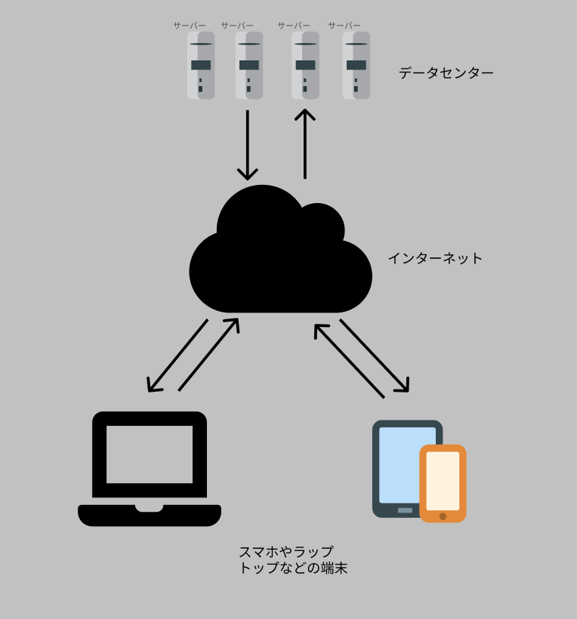

## 第一回 プログラミングの勉強方法を紹介。プログラミング言語を決めよう

- Web 系で必要な知識
- スマホ系で必要な知識

プログラミングを学習する方法を紹介していきたいと思います。
今回はその第一回です。

何かスポーツをする場合、まず種目をきめますよね。同じように、プログラムで何を作りたいか決めましょう。
なぜなら、何を作りたいかによって、学ぶプログラミング言語が変わってくるからです。

今回は Web 系とスマホ系にジャンルを絞りました。実際はもっと種類があるのですが、それはまた別の機会に紹介します。

## 自己紹介

現役プログラマー。この道 15 年ですが、まだまだ現役を続けたいと思っています。
バックエンドを担当していますが、たまにフロントを少しだけお手伝いします。

## Web 系で必要な知識

Web サイトやホームページと言われるものです。近年非常に需要が多い分野でもあります。

一言に Web 系と言ってもその形態は多様ですが、ここではフロントエンドとバックエンドに分けて話をしたいと思います。

図のラップトップやスマホに配置されるソフトウェアがフロントエンドで、データセンターに配置されるのがバックエンドです。

フロントエンドとバックエンドは、インターネットを仲介してやり取りします。それはそれで一つの記事がかけてしまいますので、別の記事で紹介します。

最初のうちは、フロントエンドとバックエンドは、両方学ぶのをオススメします。ただし、極める必要はありません。最終的にはどちらかに絞ることになると思いますが、両方分かってないとまともに設計するのが難しいです。

### フロントエンド

皆さんが今まさに見ている、ブラウザの画面に表示されている部分です。
そして、おそらく技術的な変化がもっとも激しい分野の一つではないかと私は思います。

#### フロントエンドで必要な知識

- HTML/CSS (マークアップ言語)
- Javascript/Typescript (プログラミング言語)
- React/Vue (フレームワーク)

フロントエンドは技術的な変化が激しいので、これをやっておけば安心、とは言えません。ここに書いたのは 2021 年時点で比較的に人気な言語とフレームワークです。

フレームワークとは何ぞや？という説明はまた別の記事で書きたいと思います。今はフロントエンドを開発する上で便利なもの、という認識で OK です。

#### おすすめプログラミング言語

Typescript です。

Typescript は Javascript の上位互換であり、Typescript が分かれば Javascript も理解できます。
それに、Javascript は型が存在しないのでバグが混入しやすいこともあり、最近は Typescript を採用する企業も増えています。つまり、Typescript が触れると就職にも優位になるでしょう。

[Typescript の公式ページはこちら](https://www.typescriptlang.org/)。※英語です。

#### おすすめフレームワーク

日本で働くなら、Vue です。

国内だと Vue の方が日本語のドキュメントが充実していたという理由で人気があります。Vue/React ともにモダンなフレームワークであることから、若手が参入しやすいのでぜひ勉強して下さい。ちなみに海外だと React が支配的だと思われます。いずれ海外へ、と考えている方は React の方がいいかもです。ちなみにこのブログページは React + Gatsby で作られています。

[Vue の公式ページはこちら](https://jp.vuejs.org/)。

### バックエンド

フロントエンドから受け取ったデータを加工して、データベースにいれたり、データベースから取り出したデータをフロントに送ったりするシステムです。

バックエンド、という名前が示すとおり、後ろにいるシステムです。重要なデータはバックエンドで取り扱われることが多いです。
私が仕事で担当しているのもこのバックエンドです。

#### バックエンドで必要な知識

- Go/Python/Ruby/Node/Rust/PHP (プログラミング言語)
- AWS/Azure/GCP (クラウドサービス)
- MySQL/Postgress (RDMS)
- NoSQL
- Docker

各項目ごとに複数列挙しましたが最初は一つ選んで、まずはそれを集中的に学習するのをオススメします。

#### バックエンドでオススメのプログラミング言語

Go を推薦します。需要が多い上に比較的学習しやすく、まだ歴史が浅い言語なので覚えておくと就職で有利だと思います。

ちなみに、私が今使っている言語は、Typescript(Node)と Python です。
Node と Python も採用している企業が多く、これからも採用が減ることはないと思われるので悪くない選択だと思います。

[Go の公式サイトはこちら](https://golang.org/)。※英語です。

#### バックエンドでオススメしないプログラミング言語

PHP、Ruby と Rust です。

PHP や Ruby は歴史が長く、多くのシステムで使われています。割合で言えば比較的古いシステムで使われている傾向が強いとも言えます。古いシステムということは、熟練者が頑張っているということです。つまり、初心者がなかなか活躍しにくい可能性があります。

Rust は単純に学習が難しいというのが問題ですし、まだ本格的に採用している会社が少ない点です。逆に、そこを狙っていく手もありますが、その場合は覚悟を決めて学習してください。私もフルタイムで Rust 触ってましたが、他の言語と比べると調査してる時間がすごく長くなります。忍耐強くない人はやめておいた方がよい言語です。

#### クラウドサービス

AWS をオススメします。

単純に大きなシェア(30%くらい)をもっています。採用している企業も多いし、これからもっと増えると思います。
無料枠があるので、少し遊びで触ってみるのもありです。

ただし、何も考えずに使うと、とんでもなくお金がかかることもあるので、きちんと費用を見ながら触りましょう。
そういう意味だと初心者の方にはやや敷居が高いかもしれません。お金が心配な方は安いさくらサーバーか、ローカルで Docker を使ってみるのがよいでしょう。

また別の記事で AWS の使い方を紹介したいと思います。

[AWS の公式サイトはこちら](https://aws.amazon.com/jp/)。

#### NoSQL

NoSQL というのは SQL でないデータベースの総称であり、いろいろなデータベースがあります。
一番有名所といえば、MongoDB でしょうか。ただし、AWS を触るのであれば、DynamoDB という素晴らしいものもあります。

歴史があまり長くないのでこれといったオススメはありません。無料で学習するなら MongoDB がよいでしょう。

[MongoDB の公式サイトはこちら](https://www.mongodb.com/2)。

#### Docker

Docker 社が提供する無料の仮想環境です。こちらもバックエンドではかなり使われているものなので、学習しておくのがよいです。
ただで使えるので、ぜひ自分のパソコンに入れてみてください。

[Docker の公式サイトはこちら](https://www.docker.com/)。

## スマホ系

皆さんが普段触っているスマホアプリのことです。

- iPhone アプリ
- アンドロイドアプリ

実は言うと、スマホ系アプリも Web 系と同じようにフロントエンドとバックエンドに分けることができます。
アプリの場合は、フロントエンドというか、クライアントと表現することが多いかもしれません。

Facebook や Youtube のように、ユーザーが何かを共有するシステムではバックエンドが必要になります。

スマホ系のバックエンドも、Web 系で紹介したバックエンドと基本的に同じと思っていただいて構いません。
基本的にスマホを作る場合は Web も作ることが多いので、共通のバックエンドのシステムを利用することでしょう。

よってここでは、アプリ側だけを紹介します。

### iPhone アプリで必要な知識

- swift (プログラミング言語)
- Xcode (開発ツール)

iPhone 向けアプリであれば、Mac で開発するのがよいでしょう。
Xcode もアプリを開発する上で重要なツールになりますので、使い方を覚えて行く必要があります。
しかし、Web 系と違ってこれ一択なので、変な心配はないです。

[Swift の公式サイトはこちら](https://developer.apple.com/jp/swift/)。

[Xcode の公式サイトはこちら](https://developer.apple.com/jp/xcode/)。

### アンドロイドアプリで必要な知識

- Kotlin (プログライング言語)
- Android Studio (開発ツール)

Kotlin は比較的新しい言語です。Java という言語でもアプリ開発が行われていますが、最近は Kotlin を採用するケースが多いようです。
Kotlin を勉強した後に、Java も学習してみるとよいでしょう。

[Kotlin の公式サイトはこちら](https://kotlinlang.org/)。

[Andraoid Studio の公式サイトはこちら](https://developer.android.com/studio/intro?hl=ja)。
